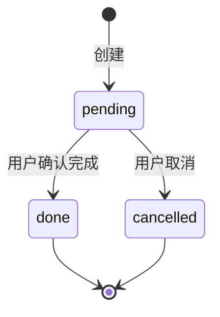

# 数据库表结构设计

本文档描述 tuntun-chat 业务数据的表结构、字段含义、索引与典型查询，供待办提醒、日程管理、每日总结等功能开发时查阅。

---

## 一、存储方案

| 项 | 说明 |
|----|------|
| 引擎 | SQLite（`better-sqlite3`） |
| 默认路径 | `data/bot.db`（可通过环境变量 `DB_PATH` 覆盖） |
| 与配置表关系 | 与 `config` 表共存于同一数据库文件；`config` 存功能开关，`todos` 等业务表存用户数据 |
| 迁移策略 | 启动时 `CREATE TABLE IF NOT EXISTS`；字段变更时再补 `ALTER TABLE` 或版本化迁移（当前未引入迁移框架） |
| 时间格式 | 统一存 **ISO 8601 字符串**（含时区偏移），业务层按 `Asia/Shanghai` 解析与展示 |

### 已有表：`config`

功能配置，由 `src/config/store.ts` 维护。键 `feature_config` 存 JSON，包含 `schedule` / `todo` / `dailySummary` 开关与参数。

---

## 二、表：`todos`（待办提醒）

### 2.1 定位

记录用户通过聊天（或后续管理 API）创建的待办事项，供定时任务扫描并推送提醒。

- **与日程的区别**：待办强调「到点提醒去做」，见 [SCHEDULE-VS-TODO.md](./SCHEDULE-VS-TODO.md)。
- **与飞书 Task API**：第一版以自建表为主；后续可增 `feishu_task_id` 字段做双向同步。

### 2.2 DDL

```sql
CREATE TABLE IF NOT EXISTS todos (
  id              INTEGER PRIMARY KEY AUTOINCREMENT,
  open_id         TEXT NOT NULL,
  chat_id         TEXT NOT NULL,
  title           TEXT NOT NULL,
  due_at          TEXT NOT NULL,
  remind_at       TEXT NOT NULL,
  status          TEXT NOT NULL DEFAULT 'pending',
  source          TEXT NOT NULL DEFAULT 'chat',
  raw_message     TEXT,
  reminded_at     TEXT,
  due_notified_at TEXT,
  completed_at    TEXT,
  created_at      TEXT NOT NULL,
  updated_at      TEXT NOT NULL
);

CREATE INDEX IF NOT EXISTS idx_todos_remind_scan
  ON todos (status, remind_at);

CREATE INDEX IF NOT EXISTS idx_todos_due_scan
  ON todos (status, due_at);

CREATE INDEX IF NOT EXISTS idx_todos_open_status_due
  ON todos (open_id, status, due_at);
```

### 2.3 字段说明

时间相关字段分三类，**不要混用**（常见误区：把 `due_notified_at` 当成「解析出的提醒时间」——它只在到期通知**成功推送后**才有值）：

| 分类 | 字段 | 何时写入 | 用途 |
|------|------|----------|------|
| **计划时间**（创建时由 LLM + 业务层写入） | `due_at`、`remind_at` | 用户创建待办时 | 用户说的到期时刻；以及「提前 N 分钟提醒」的时刻 |
| **推送状态**（定时任务推送成功后写入） | `reminded_at`、`due_notified_at` | 到点且飞书消息发送成功时 | 幂等标记，避免重复推送；**创建时必为 NULL** |
| **审计时间** | `created_at`、`updated_at`、`completed_at` | 创建 / 更新 / 完成时 | 记录生命周期 |

| 字段 | 类型 | 必填 | 说明 |
|------|------|------|------|
| `id` | INTEGER | 是 | 自增主键；列表展示时作为序号引用（如「完成第 1 条」） |
| `open_id` | TEXT | 是 | 飞书用户 `open_id`，待办归属人 |
| `chat_id` | TEXT | 是 | 创建时的会话 ID，定时主动推送时使用（不依赖原 `message_id`） |
| `title` | TEXT | 是 | 待办标题/内容，由 LLM 从用户消息抽取 |
| `due_at` | TEXT | 是 | **计划到期时间**（ISO 8601）。LLM 从用户消息解析「什么时候该做完」；查库确认解析结果请看此字段 |
| `remind_at` | TEXT | 是 | **计划提前提醒时间**（ISO 8601）。由代码计算：`due_at - reminderMinutes`（默认 15 分钟） |
| `status` | TEXT | 是 | 状态，见 [2.4 状态枚举](#24-状态枚举) |
| `source` | TEXT | 是 | 创建来源：`chat`（用户聊天）、`admin`（管理 API，预留） |
| `raw_message` | TEXT | 否 | 用户原始输入，便于排查 LLM 抽取问题 |
| `reminded_at` | TEXT | 否 | **提前提醒已推送**的时间戳；NULL = 尚未发过提前提醒（新建记录正常为 NULL） |
| `due_notified_at` | TEXT | 否 | **到期通知已推送**的时间戳；NULL = 尚未发过到期通知（新建记录正常为 NULL，**不代表未解析出时间**） |
| `completed_at` | TEXT | 否 | 标记完成时间 |
| `created_at` | TEXT | 是 | 记录创建时间 |
| `updated_at` | TEXT | 是 | 记录最后更新时间 |

### 2.4 状态枚举

| 值 | 含义 | 是否参与定时扫描 |
|----|------|------------------|
| `pending` | 待完成 | 是 |
| `done` | 已完成 | 否 |
| `cancelled` | 已取消 | 否 |



### 2.5 时间字段关系

**示例**：用户说「帮我记一下待办，明天早上 7 点起来买个车票」，当前为 2026-06-13 22:46（上海）。

**① 创建落库时**（`createTodo` 只写计划时间与元数据，不写推送状态）：

| 字段 | 值 | 说明 |
|------|-----|------|
| `due_at` | `2026-06-14T07:00:00+08:00`（或等价的 UTC 如 `2026-06-13T23:00:00.000Z`） | LLM 解析的到期时刻 |
| `remind_at` | `2026-06-14T06:45:00+08:00` | `due_at - 15 分钟` |
| `reminded_at` | NULL | 正常：提前提醒还没到点 |
| `due_notified_at` | NULL | 正常：到期通知还没到点 |

**② 定时任务扫描后**（`scheduler/reminder.ts`，每分钟）：

```
  1. remind_at <= now 且 reminded_at IS NULL 且 status = pending
     → 发提前提醒（⏰）→ 写 reminded_at = now

  2. due_at <= now 且 due_notified_at IS NULL 且 status = pending
     → 发到期通知（📌）→ 写 due_notified_at = now
```

**③ 如何确认「提醒时间是否解析成功」**

查 `due_at` 与 `remind_at`，不要查 `due_notified_at`：

```sql
SELECT id, title, due_at, remind_at, reminded_at, due_notified_at, raw_message
FROM todos
ORDER BY id DESC
LIMIT 5;
```

- 若 `due_at` / `remind_at` 符合用户说的时刻 → 解析成功，等 scheduler 到点推送即可。
- 若 `due_at` 为空或明显错误 → 排查 `raw_message` 与 `src/todo/extract.ts` 的 LLM 抽取。
- 若到点后 `due_notified_at` 仍为 NULL → 排查 scheduler 是否启动、飞书发消息权限、推送失败日志（推送失败**故意不**写该字段，下一分钟会重试）。

`reminderMinutes` 来自功能配置 `FeatureConfig.todo.reminderMinutes`（默认 15），见 `src/config/store.ts`。

### 2.6 索引说明

| 索引 | 用途 |
|------|------|
| `idx_todos_remind_scan` | 定时任务扫描待发送的**提前提醒** |
| `idx_todos_due_scan` | 定时任务扫描待发送的**到期提醒** |
| `idx_todos_open_status_due` | 按用户查询待办列表、今日待办、逾期待办 |

### 2.7 典型查询

**扫描提前提醒（scheduler 每分钟）：**

```sql
SELECT * FROM todos
WHERE status = 'pending'
  AND remind_at <= ?
  AND reminded_at IS NULL;
```

**扫描到期提醒：**

```sql
SELECT * FROM todos
WHERE status = 'pending'
  AND due_at <= ?
  AND due_notified_at IS NULL;
```

**用户待办列表：**

```sql
SELECT * FROM todos
WHERE open_id = ?
  AND status = 'pending'
ORDER BY due_at ASC;
```

**今日待办（按上海时区日期过滤，在应用层计算 day_start/day_end 后传入）：**

```sql
SELECT * FROM todos
WHERE open_id = ?
  AND status = 'pending'
  AND due_at >= ?
  AND due_at < ?;
```

**标记完成：**

```sql
UPDATE todos
SET status = 'done', completed_at = ?, updated_at = ?
WHERE id = ? AND open_id = ? AND status = 'pending';
```

### 2.8 业务约束（应用层）

| 规则 | 说明 |
|------|------|
| 创建时 `due_at` 必须晚于当前时间 | 解析失败或已过期则追问用户，不写入 |
| 仅 `pending` 可完成或取消 | 防止重复更新 |
| `open_id` 与操作者一致 | 用户只能操作自己的待办（MVP 不支持代办他人） |
| 提醒幂等 | 依赖 `reminded_at` / `due_notified_at` 为空才发送；服务重启后未标记的记录会补发 |
| 新建时 `reminded_at`、`due_notified_at` 必为 NULL | 由 `INSERT` 语句决定，非解析失败；计划时间在 `due_at` / `remind_at` |

---

## 三、预留扩展（尚未建表）

以下表在后续功能中可能引入，设计时预留思路，**当前未实现**。

| 表名 | 用途 | 关联 |
|------|------|------|
| `schedules` | 自建日程缓存（若不完全依赖飞书日历 API） | `open_id` |
| `daily_summary_logs` | 每日总结推送记录，避免重复发送 | `open_id`, `summary_date` |
| `user_prefs` | 用户级偏好（时区、默认提醒分钟数） | `open_id` |

### `todos` 表可能的后续字段

| 字段 | 用途 |
|------|------|
| `feishu_task_id` | 与飞书 Task API 同步时的远端 ID |
| `repeat_rule` | 周期性待办（如每天、每周） |
| `priority` | 优先级 |
| `notes` | 备注 |

新增字段时在本节记录，并在代码中做向后兼容的 `ALTER TABLE`。

---

## 四、代码落点（已实现）

| 路径 | 职责 | 状态 |
|------|------|------|
| `src/todo/schema.ts` | DDL 常量、`initTodoSchema(db)` | ✅ |
| `src/todo/store.ts` | `todos` 表 CRUD 与扫描查询；首次访问时建表 | ✅ |
| `src/todo/types.ts` | `TodoRecord`、`TodoStatus` 等类型 | ✅ |
| `src/todo/extract.ts` | LLM 结构化意图抽取（JSON） | ✅ |
| `src/todo/service.ts` | 创建 / 列表 / 完成 / 取消业务编排 | ✅ |
| `src/features/todo.ts` | 待办能力入口，转调 `service` | ✅ |
| `src/scheduler/reminder.ts` | 每分钟扫描并推送提前/到期提醒 | ✅ |
| `src/feishu/client.ts` | `sendTextToChat` 主动发消息 | ✅ |

表结构变更时**先改本文档，再改 `schema.ts` 与 `store.ts`**，保持同步。

---

## 五、相关文档

- [SCHEDULE-VS-TODO.md](./SCHEDULE-VS-TODO.md) — 待办与日程的定位差异
- [ARCHITECTURE.md](./ARCHITECTURE.md) — 模块职责与数据流
- [思路.md](./思路.md) — 当前进度
- [ROADMAP.md](./ROADMAP.md) — 后续开发建议
